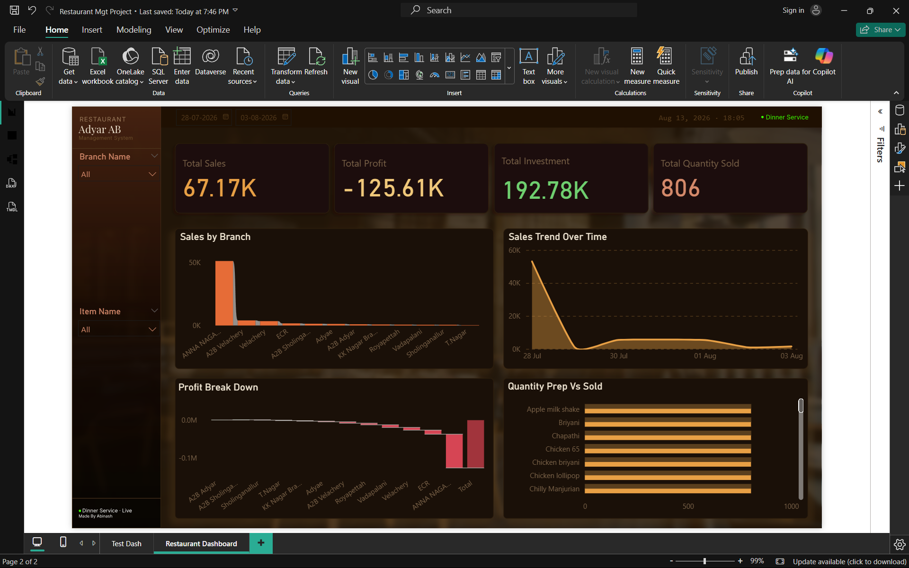

# 🍴 Restaurant Management System (Python + SQL + Power BI)

## 📖 Overview
This project demonstrates a complete data pipeline for restaurant operations:
- **Python** → Collects restaurant, branch, item, and sales data from user input.
- **SQL Server** → Stores structured data in a star schema (Dim_Restaurant, Dim_Branch, Dim_Item, Fact_Sales).
- **Power BI** → Cleans data, creates DAX measures, and builds interactive dashboards.

## ⚙️ Tech Stack
- Python (pyodbc for SQL connection)
- SQL Server
- Power BI

## 🗂️ Repository Structure
Restaurant-Mgt-System/
│
├── python/
│   └── data_entry.py        # Python script for data input
│
├── sql/
│   ├── schema.sql           # Database schema (tables)
│   └── sample_data.sql      # Example inserts
│
├── powerbi/
│   ├── RestaurantMgt.pbix   # Power BI dashboard
│   └── screenshots/         # Dashboard images
│
├── README.md
└── LICENSE

## 🚀 How to Run
1. Clone repo:
   ```bash
   git clone https://github.com/abinash-source/Restaurant-Management-System-Python-SQL-Power-BI.git
python python/data_entry.py
RUN sql/schema.sql

## 📊 Dashboard Preview

